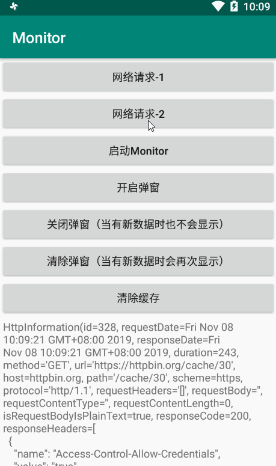

# Monitor

[](https://jitpack.io/#leavesC/Monitor)

---

添加远程仓库地址：

```groovy
	allprojects {
		repositories {
			...
			maven { url 'https://jitpack.io' }
		}
	}
```

添加依赖：

```groovy
	implementation 'com.github.leavesC:Monitor:1.0.9'
```

添加 **MonitorInterceptor** 作为项目中 **OkHttpClient** 的拦截器

```groovy
    OkHttpClient okHttpClient = new OkHttpClient.Builder()
            .addInterceptor(new MonitorInterceptor(Context)).build();
```

**然后？没了，OK了**


Apk下载：[Android OkHttp 网络请求调试利器 - Monitor](https://www.pgyer.com/leavesC_Monitor)

### 一、概述

**Monitor** 是一个适用于使用了 **OkHttp/Retrofit** 网络请求框架的项目，可以拦截并缓存应用内的所有网络请求和响应信息，且可以以 Notification 和 Activity 的形式来展示具体内容



此外，Monitor 使用到的依赖还包括：

```groovy
    compileOnly "org.jetbrains.kotlin:kotlin-stdlib-jdk7:$kotlin_version"
    compileOnly 'com.google.android.material:material:1.0.0'
    compileOnly 'androidx.constraintlayout:constraintlayout:1.1.3'
    compileOnly 'androidx.lifecycle:lifecycle-extensions:2.1.0'
    compileOnly 'androidx.room:room-runtime:2.2.1'
    kapt 'androidx.room:room-compiler:2.2.1'
    compileOnly "com.squareup.okhttp3:okhttp:4.2.2"
    compileOnly 'com.google.code.gson:gson:2.8.5'
```

**此处为了方便外部项目统一依赖库的版本，所以 Monitor 内部引用均为 `compileOnly`，所以如果你发现在引入本库后编译失败，那么有可能就是缺少了以上依赖中的某一个，补全即可**

### 二、使用

只要添加了 **MonitorInterceptor** 拦截器，之后 **Monitor** 就会自动记录下所有 **网络请求的请求信息以及响应体**，且自动弹窗提示。当然，为了照顾到其他一些特殊情况，**Monitor** 也对外提供了一些方便访问的 Api

**注意：以下方法需要在实例化 MonitorInterceptor 后再调用，否则会抛出异常**

 **1. 启动 Http 列表页**

```kotlin
    startActivity(Monitor.getLaunchIntent(Activity));
```

 **2. 开启弹窗**

```kotlin
    Monitor.showNotification(true);
```

 **3. 关闭弹窗（当有新数据时也不会显示）**

```kotlin
    Monitor.showNotification(false);
```

 **4. 清除弹窗（当有新数据时会再次显示）**

```kotlin
    Monitor.clearNotification();
```

 **5. 清除缓存**

```kotlin
    Monitor.clearNotification();
```

 **6. 监听 Http 数据变化**

```kotlin
        //参数用于监听最新指定条数的数据变化，如果不传递参数则会监听所有的数据变化
        Monitor.queryAllRecord(10).observe(this, new Observer<List<HttpInformation>>() {
            @Override
            public void onChanged(@Nullable List<HttpInformation> httpInformationList) {
                tv_log.setText(null);
                if (httpInformationList != null) {
                    for (HttpInformation httpInformation : httpInformationList) {
                        tv_log.append(httpInformation.toString());
                        tv_log.append("\n\n");
                        tv_log.append("*************************************");
                        tv_log.append("\n\n");
                    }
                }
            }
        });
```

### 三、致谢

Monitor 的一部分灵感来源于另一个开源项目：[Chuck](https://github.com/jgilfelt/chuck)，因此你可以看到两个项目的 UI 基本是相同的，因为我觉得 UI 是次要的，也懒得去想新的交互方式，我借鉴的主要是其拦截器的数据抓取思路。而因为我对 Chuck 有些地方不太满意，包括**Notification 无法动态精确控制、无法通过 API 清除缓存、无法监听数据变化**等，所以才打算自己来实现

当中，okhttp 和 gson 不必说，room 和 lifecycle 都是 Google Jetpack 组件的一部分，room 和 lifecycle 搭配使用真的还是蛮爽的~~